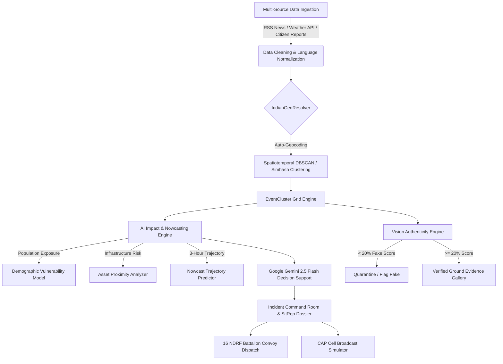

# 🌧️ VARSHANET 2.0

## National Weather Big Data Analytics, Real-Time AI Impact Nowcasting & Disaster Decision Support Grid

[](https://fastapi.tiangolo.com/)
[](https://react.dev/)
[](https://vitejs.dev/)
[](https://ai.google.dev/)
[](https://leafletjs.com/)
[](https://tailwindcss.com/)
[](https://websockets.readthedocs.io/)
[](LICENSE)

---

## 📌 Table of Contents
1. [Platform Overview](#-platform-overview)
2. [Key Highlights & Operational Capabilities](#-key-highlights--operational-capabilities)
3. [Technology Stack](#-technology-stack)
4. [Architecture & Closed-Loop Intelligence Workflow](#-architecture--closed-loop-intelligence-workflow)
5. [Repository & Directory Structure](#-repository--directory-structure)
6. [Git Workflow: How to Fork, Clone, Branch, Pull & Push](#-git-workflow-how-to-fork-clone-branch-pull--push)
7. [Local Setup & Installation Guide](#-local-setup--installation-guide)
8. [Configuration & Environment Variables (`.env`)](#-configuration--environment-variables-env)
9. [Role-Based Access Control (RBAC)](#-role-based-access-control-rbac)
10. [REST API & WebSocket Documentation](#-rest-api--websocket-documentation)
11. [Contributing Guidelines](#-contributing-guidelines)
12. [License](#-license)

---

## 🌧️ Platform Overview

**VARSHANET 2.0** is an enterprise-grade National Weather Big Data Analytics and AI Disaster Impact Nowcasting Grid built specifically for India. 

It continuously ingests real-time observations across **IMD Doppler Weather Radars (DWR)**, **INSAT-3DR/3DS Satellite Imagers**, **Multi-Channel Indian News Streams** (*TOI, NDTV, India Today, Down To Earth, Google News*), **Open-Meteo Global Forecasts**, and **Citizen Geotagged Ground Proofs**.

VARSHANET transforms raw data into actionable life-safety intelligence:
* **Evidence Confidence (0–100%)**: Multi-source corroboration and optical proof analysis.
* **Impact Risk Index (0–100%)**: Dynamic population exposure and critical infrastructure risk.
* **Response Priority (P1–P4)**: Instant tactical triage for State Disaster Management Authorities (SDMA) & National Disaster Response Force (NDRF).

```
┌──────────────┐     ┌──────────────┐     ┌──────────────┐     ┌──────────────┐
│  1. DETECT   │ ──► │  2. VERIFY   │ ──► │ 3. CORRELATE │ ──► │ 4. NOWCAST   │
│ Multi-Source │     │ AI Vision/ML │     │ Space & Time │     │ 3-Hr Traject │
└──────────────┘     └──────────────┘     └──────────────┘     └──────────────┘
                                                                       │
┌──────────────┐     ┌──────────────┐     ┌──────────────┐             │
│  7. SITREP   │ ◄── │  6. DISPATCH │ ◄── │ 5. RECOMMEND │ ◄───────────┘
│ PDF Dossier  │     │ 16 NDRF Bat. │     │ Gemini GenAI │
└──────────────┘     └──────────────┘     └──────────────┘
```

---

## ⚡ Key Highlights & Operational Capabilities

### 1. 🚒 Nearest NDRF Battalion Distance & Route Engine
* Integrates a directory of **all 16 official National Disaster Response Force (NDRF) Battalions** across India (coordinates, commandants, unit strengths, 24x7 control lines).
* Calculates exact **Haversine Distance ($km$)** and **Convoy Road ETA** ($0.5\text{h} + \text{distance}/55\text{km/h}$) dynamically from active disaster clusters or live browser GPS.
* Generates official NDRF Requisition Orders addressed directly to the nearest primary battalion.

### 2. 🚨 Live Emergency Red Alert Ticker Banner
* Auto-rotating banner cycling every 5 seconds through all active national warnings with `< Prev` and `Next >` navigation controls.
* Live flashing `⚡ JUST IN: NEW RED ALERT` badge upon receiving real-time WebSocket alerts.
* 1-click jump to open the active incident in the **Incident Command Room**.

### 3. ⏱️ Strict 6-Hour Persistent Freshness Rule & 5-Min Auto-Sync
* Grounded observation freshness to real clock time (`Date.now() - timestamp <= 6 * 3600 * 1000`). Observations $\le 6\text{h}$ show `🔥 LATEST (Xh Ym left)`; older ones automatically transition to archived status.
* Live `5:00` countdown timer in the navbar with an on-demand **`Sync Live`** button for instant multi-channel Indian news & weather fetching.

### 4. 📸 Citizen 2–3 Photo Proofs with AI Visual Authenticity (<20% Fake Filter)
* Citizen Portal with **Drag & Drop** dropzone, **`Ctrl+V`** clipboard paste, and photo preview gallery (up to 3 photos).
* **AI Visual Authenticity Engine** ($0–100\%$):
  * Analyzes perceptual hash, HSV color distribution (flood turbid water / storm overcast), contrast, and optical entropy.
  * **Strict `< 20%` Fake Detection Rule**: If score is $< 20\%$, the visual is flagged as `🔴 FAKE / UNRELATED VISUAL` and quarantined.
* **Clean Citizen Receipt**: Citizens receive an official transmission ticket without exposing internal AI weights.

### 5. 📢 Admin Pre-Verified Incident Dispatch & Automatic Map Pinning
* Located inside the **Admin Panel** (`Admin Ops` tab).
* **100% Pre-Verified (Zero Moderation Delay)**: Admin posts are marked `VERIFIED` with `99.8% Credibility Score`.
* **Automatic Geographic Coordinate Resolution**: Selecting or entering cities (*Bhopal, Mumbai, Guwahati, Delhi, etc.*) automatically resolves GPS coordinates and creates/updates the active cluster on the **National Weather Map** immediately.

### 6. 🖼️ Verified Citizen Evidence Gallery in Incident Command Room
* Dedicated **`📸 Verified Ground Truth & Citizen Photo Evidence Gallery`** inside the Incident Command Room.
* Displays all geotagged photos uploaded by citizens for that disaster cluster with trust badges and 1-click **Fullscreen Lightbox Inspection**.

### 7. 🛰️ MoES Big Data: 33 Doppler Weather Radars & INSAT-3DR/3DS Satellites
* **33 IMD Doppler Weather Radar (DWR) Stations** across India with peak reflectivity ($\text{dBZ}$), rain rates ($\text{mm/h}$), and hydrometeor classifications.
* **INSAT-3DR/3DS Multi-Spectral Imager Feeds**: Monitored sectors across Northern Himalayas, Bay of Bengal, Arabian Sea, Western Ghats, and Gangetic Plains with Cloud Top Temperature (CTT), TIR Kelvin, and cloud motion vectors.
* **IMD Extreme Weather ML**: Himalayan Orographic Cloudburst Lead-Time Prediction & Wet-Bulb Globe Temp (WBGT) Heatwave Index.

---

## 🛠️ Technology Stack

| Domain | Technologies & Libraries |
| :--- | :--- |
| **Frontend UI** | **React 18**, **TypeScript**, **Vite 8**, **TailwindCSS 3.4**, **Lucide React Icons**, **Axios** |
| **Mapping & GIS** | **Leaflet 1.9**, **React-Leaflet**, **ESRI World Imagery**, **OpenStreetMap**, **GeoJSON** |
| **Backend API** | **FastAPI 0.115+**, **Python 3.10+**, **Uvicorn ASGI**, **Pydantic v2**, **SQLAlchemy 2.0** |
| **Database & Cache** | **SQLite** (Default local) / **PostgreSQL + PostGIS** (Production ready) |
| **Real-Time Streaming** | **Native WebSockets** (`/ws/weather`) with event-driven pub/sub architecture |
| **AI / GenAI & Vision** | **Google Gemini 2.5 Flash & 1.5 Flash**, **Scikit-learn**, **Pillow (PIL)**, **ImageHash (Perceptual DHash/AHash)** |
| **NLP & Deduplication** | **Simhash 64-bit spatial clustering**, **TF-IDF Vectorization**, **Indic Script Unicode Normalizer** |
| **Data Ingestion** | **Feedparser** (RSS), **HTTPX** (Async HTTP), **BeautifulSoup4**, **Open-Meteo API** |

---

## 🏛️ Architecture & Closed-Loop Intelligence Workflow



---

## 📂 Repository & Directory Structure

```text
varshanet/
├── backend/                             # FastAPI Backend Application
│   └── app/
│       ├── api/                         # REST & WebSocket API Routes
│       │   └── v1/
│       │       ├── admin.py             # Admin metrics and controls
│       │       ├── alerts.py            # Active emergency alerts
│       │       ├── analytics.py         # AI lab test & overview metrics
│       │       ├── citizen.py           # Citizen submission & tracking
│       │       ├── events.py            # Event clusters & active incidents
│       │       ├── impact.py            # Impact assessment & verified photos
│       │       ├── map.py               # Map GeoJSON & heatmap data
│       │       ├── meteorology.py       # DWR Radar, INSAT & Extreme ML
│       │       ├── reports.py           # Report ingestion & admin-publish
│       │       ├── sources.py           # Multi-channel sync trigger
│       │       ├── system.py            # Health & pipeline telemetry
│       │       └── verification.py      # Admin verification queue
│       ├── core/                        # Configuration & Database
│       │   ├── config.py                # Pydantic Settings & .env loader
│       │   └── database.py              # SQLAlchemy engine & session factory
│       ├── models/                      # SQLAlchemy Database Models
│       │   └── models.py                # Reports, Clusters, Alerts, Assets, Evals
│       ├── schemas/                     # Pydantic Request/Response Schemas
│       │   └── schemas.py               # Strict type validation definitions
│       └── main.py                      # FastAPI App Entrypoint & CORS setup
│
├── frontend/                            # React 18 + TypeScript + Vite Application
│   ├── src/
│   │   ├── components/                  # Reusable UI Components
│   │   │   ├── admin/                   # Admin Queue, Health & Incident Post Form
│   │   │   │   ├── AdminIncidentPostForm.tsx
│   │   │   │   ├── SystemHealthView.tsx
│   │   │   │   └── VerificationQueue.tsx
│   │   │   ├── citizen/                 # Citizen Form & Drag-and-Drop Dropzone
│   │   │   │   └── CitizenReportForm.tsx
│   │   │   ├── common/                  # Navbar, Alerts Banner, Metric Cards
│   │   │   │   ├── AlertsBanner.tsx
│   │   │   │   ├── MetricCard.tsx
│   │   │   │   └── Navbar.tsx
│   │   │   ├── incident/                # Incident Command Room Modules
│   │   │   │   ├── AudioEmergencyBroadcast.tsx
│   │   │   │   ├── CapBroadcastSimulator.tsx
│   │   │   │   ├── EmergencyResourceDispatch.tsx  # 16 NDRF Battalions & GPS ETA
│   │   │   │   ├── EvidenceChain.tsx
│   │   │   │   ├── ImpactSummary.tsx
│   │   │   │   ├── IncidentHeader.tsx
│   │   │   │   ├── InfrastructureRiskPanel.tsx
│   │   │   │   ├── PredictionAccuracy.tsx
│   │   │   │   ├── ResponseRecommendations.tsx
│   │   │   │   ├── RiskTrajectory.tsx
│   │   │   │   ├── SitRepDossierModal.tsx
│   │   │   │   ├── StreetViewPin.tsx
│   │   │   │   └── VerifiedGroundEvidenceGallery.tsx # Verified Photo Grid
│   │   │   ├── map/                     # National Leaflet & Radar Map Views
│   │   │   └── reports/                 # Report List, Filters & Detail Modal
│   │   ├── pages/                       # Top-Level Page Views
│   │   │   ├── AdminPage.tsx            # Official Post, Queue & Health
│   │   │   ├── AnalyticsPage.tsx        # Big Data, Radars, INSAT & AI Lab
│   │   │   ├── CitizenPage.tsx          # Citizen Reporting & Tracking
│   │   │   ├── DashboardPage.tsx        # Dynamic 6-Metric Overview
│   │   │   ├── EventsPage.tsx           # Active Disaster Clusters
│   │   │   ├── IncidentCommandRoomPage.tsx # Master Incident Command
│   │   │   ├── MapPage.tsx              # Fullscreen Interactive Map
│   │   │   └── ReportsPage.tsx          # All Ingested Reports Feed
│   │   ├── services/                    # Axios API Client & WebSocket Hooks
│   │   │   └── api.ts                   # Type-safe API endpoints
│   │   ├── types/                       # TypeScript Data Interfaces
│   │   │   └── index.ts
│   │   ├── App.tsx                      # Root Application & State Manager
│   │   └── main.tsx                     # React DOM Entrypoint
│   ├── package.json
│   ├── tailwind.config.js
│   ├── tsconfig.json
│   └── vite.config.ts
│
├── processing/                          # AI, ML & Analytical Pipeline
│   ├── cleaning/                        # Multilingual NLP & Text Normalizer
│   │   └── text_cleaner.py
│   ├── deduplication/                   # 64-bit Simhash Deduplication
│   │   └── simhash_dedup.py
│   ├── geolocation/                     # Indian City & State Geo Resolver
│   │   └── indian_geo_resolver.py
│   ├── impact/                          # Population Exposure & Risk Engine
│   │   └── impact_engine.py
│   ├── verification/                    # Google Gemini & Local Edge ML
│   │   ├── gemini_analyzer.py
│   │   └── local_classifier.py
│   ├── vision/                          # AI Visual Authenticity & Fake (<20%) Filter
│   │   └── image_analyzer.py
│   └── pipeline.py                      # Master Processing Pipeline
│
├── ingestion/                           # Data Ingestion & Connectors
│   ├── automation/                      # 5-Minute Background Auto-Sync Worker
│   │   └── live_ingestion_service.py
│   ├── connectors/                      # Multi-Channel News & Weather APIs
│   │   ├── news_api_connector.py
│   │   ├── open_meteo_connector.py
│   │   └── rss_connector.py
│   └── simulated_feed.py
│
├── .env.example                         # Example Environment Variables
├── requirements.txt                     # Python Dependencies
└── README.md                            # Complete Documentation
```

---

## 🔀 Git Workflow: How to Fork, Clone, Branch, Pull & Push

Follow this standard Git workflow to contribute to VARSHANET 2.0:

### Step 1: Fork the Repository
1. Navigate to the VARSHANET repository on GitHub.
2. Click the **Fork** button in the top-right corner.
3. Select your GitHub account as the destination.

### Step 2: Clone Your Fork Locally
Open your terminal or command prompt and run:
```bash
git clone https://github.com/<YOUR-USERNAME>/varshanet.git
cd varshanet
```

### Step 3: Configure Remote Upstream
Keep your local clone synchronized with the original repository:
```bash
git remote add upstream https://github.com/<ORIGINAL-OWNER>/varshanet.git
git remote -v
```

### Step 4: Create a New Feature Branch
Always create a descriptive branch for your changes:
```bash
# Ensure you are on main and up-to-date
git checkout main
git pull upstream main

# Create and switch to your feature branch
git checkout -b feature/ndrf-dispatch-enhancement
```

### Step 5: Make Your Changes & Test
Edit files, add components, or update backend logic. Verify that everything builds and tests pass:
```bash
# Backend verification
python -m uvicorn backend.app.main:app --reload

# Frontend build check
cd frontend
npm run build
```

### Step 6: Commit Your Changes
Use concise, conventional commit messages:
```bash
git add .
git commit -m "feat(incident): add nearest NDRF battalion GPS ETA and photo evidence lightbox"
```

### Step 7: Push to Your Fork
```bash
git push -u origin feature/ndrf-dispatch-enhancement
```

### Step 8: Open a Pull Request (PR)
1. Go to your fork on GitHub.
2. Click **Compare & pull request**.
3. Provide a clear summary of your changes, screenshots (if UI-related), and test results.
4. Submit the Pull Request for review!

### Step 9: Keeping Your Branch in Sync with Upstream
If new changes have been merged into the main repository while you were working:
```bash
git checkout main
git pull upstream main
git checkout feature/ndrf-dispatch-enhancement
git merge main
git push origin feature/ndrf-dispatch-enhancement
```

---

## 💻 Local Setup & Installation Guide

### Prerequisites
* **Python 3.10+** (Tested on Python 3.10, 3.11, 3.12, 3.14)
* **Node.js 18+** & **npm**
* **Git**

---

### 1. Backend Setup

1. **Navigate to the project root**:
   ```bash
   cd varshanet
   ```

2. **Create and activate a virtual environment**:
   * **Windows (PowerShell)**:
     ```powershell
     python -m venv venv
     .\venv\Scripts\Activate.ps1
     ```
   * **Linux / macOS**:
     ```bash
     python3 -m venv venv
     source venv/bin/activate
     ```

3. **Install dependencies**:
   ```bash
   pip install -r requirements.txt
   ```

4. **Initialize environment file**:
   ```bash
   copy .env.example .env   # On Windows
   cp .env.example .env     # On Linux/macOS
   ```

5. **Start the FastAPI server**:
   ```bash
   python -m uvicorn backend.app.main:app --host 0.0.0.0 --port 8000 --reload
   ```
   * The API server will start at: **`http://localhost:8000`**
   * Interactive Swagger Documentation: **`http://localhost:8000/api/docs`**

---

### 2. Frontend Setup

1. **Open a new terminal and navigate to `frontend/`**:
   ```bash
   cd varshanet/frontend
   ```

2. **Install npm dependencies**:
   ```bash
   npm install
   ```

3. **Start the Vite development server**:
   ```bash
   npm run dev
   ```
   * The application UI will launch at: **`http://localhost:5173`**

---

## ⚙️ Configuration & Environment Variables (`.env`)

Create a `.env` file in the root directory with the following configuration options:

```env
# ==========================================
# VARSHANET 2.0 CONFIGURATION
# ==========================================

# Core Application
PROJECT_NAME=VARSHANET-2.0
VERSION=2.0.0
API_V1_STR=/api/v1
ENVIRONMENT=development

# Database
DATABASE_URL=sqlite:///./varshanet.db

# Google Gemini AI Key (Optional - Fast local Edge-ML fallback active if omitted)
GEMINI_API_KEY=your_gemini_api_key_here

# News Ingestion & Multi-Channel Providers
NEWS_API_KEY=your_newsapi_org_key_here
NEWS_CHANNELS=GoogleNews,TimesOfIndia,NDTV,IndiaToday,DownToEarth

# Ingestion & Auto-Sync Settings
SYNC_INTERVAL_SECONDS=300            # 5-minute auto-sync loop
REPORT_RETENTION_HOURS=6             # Strict 6-hour active observation lifetime

# CORS Allowed Origins
CORS_ORIGINS=http://localhost:5173,http://127.0.0.1:5173,http://localhost:3000
```

---

## 👥 Role-Based Access Control (RBAC)

Use the top-right **Role Switcher** in the navbar to test different user experiences:

| Role | Permitted Navigation Tabs | Core Capabilities & Permissions |
| :--- | :--- | :--- |
| **👤 Citizen** | `Overview`, `Map`, `Reports`, `Events`, `Citizen Portal` | Submit ground reports with 2–3 photos (Drag & drop / Ctrl+V), auto-locate GPS, receive official tracking receipt, track report status, view public disaster safety guidance. |
| **🧑‍💻 Analyst** | `Overview`, `Incident Room`, `Map`, `Reports`, `Events`, `Analytics` | 3-Hour Nowcast trajectory analysis, population exposure modeling, critical infrastructure risk matrices, Gemini AI recommendations, automated SitRep dossier generation, MoES DWR radar & INSAT satellite telemetry. |
| **🛡️ Admin** | `Overview`, `Incident Room`, `Map`, `Reports`, `Events`, `Analytics`, `Admin Ops` | **Official Pre-Verified Incident Dispatch Post** (instantly maps & creates clusters with zero moderation delays), **AI Visual Authenticity Inspector** ($0–100\%$, $<20\%$ fake filter), 1-click verify/reject moderation queue, Big Data pipeline telemetry. |

---

## 📡 REST API & WebSocket Documentation

### Key REST Endpoints (`/api/v1`)

| Method | Endpoint | Description |
| :--- | :--- | :--- |
| `GET` | `/api/v1/analytics/overview` | Returns dynamic 6-metric counts (reports, active clusters, verified, critical alerts, states, mean AI trust). |
| `POST` | `/api/v1/citizen/submit` | Ingests citizen ground reports with attached photo evidence. |
| `GET` | `/api/v1/citizen/track/{ticket_id}`| Retrieves citizen report dispatch and verification status. |
| `POST` | `/api/v1/reports/admin-publish` | **Official Admin Dispatch**: Creates 100% pre-verified report & maps cluster immediately. |
| `GET` | `/api/v1/events/active` | Retrieves all active and verified disaster clusters with coordinates. |
| `GET` | `/api/v1/impact/{event_id}` | Full master impact assessment including **verified ground evidence photos**. |
| `GET` | `/api/v1/alerts` | Active national red/orange weather warnings (6-hour retention). |
| `POST` | `/api/v1/sources/sync-live` | Triggers immediate multi-channel news & weather sync. |
| `GET` | `/api/v1/meteorology/dwr-radar` | Real-time status for 33 IMD Doppler Weather Radar stations. |
| `GET` | `/api/v1/meteorology/insat-satellite` | Multi-spectral imager data from INSAT-3DR/3DS satellites. |
| `GET` | `/api/v1/meteorology/extreme-ml` | Orographic cloudburst lead-time and WBGT heatwave predictions. |
| `GET` | `/api/v1/system/health` | Big data pipeline health, active workers, and queue telemetry. |

### Real-Time WebSocket Feed
* **Endpoint**: `ws://localhost:8000/ws/weather`
* **Events Broadcasted**:
  * `NEW_WEATHER_REPORT` (Dispatched immediately upon report ingestion or admin post)
  * `NEW_CRITICAL_ALERT` (Dispatched upon red/orange hazard trigger)
  * `VERIFICATION_UPDATED` (Dispatched upon admin approval/rejection)

---

## 🤝 Contributing Guidelines

1. **Fork** the repository and clone it locally.
2. Create a branch: `git checkout -b feature/your-feature-name`.
3. Ensure code formatting is clean:
   * Python: Follow PEP 8 style guidelines.
   * TypeScript/React: Follow ESLint rules and maintain strict type coverage.
4. Run `npm run build` inside `frontend/` to ensure zero compilation errors.
5. Push to your branch and open a Pull Request describing your changes.

---

## 📜 License

This project is licensed under the **MIT License** - see the [LICENSE](LICENSE) file for details.

---

<div align="center">
  <sub>Built with ❤️ for Indian National Disaster Risk Reduction & Weather Big Data Intelligence.</sub>
</div>